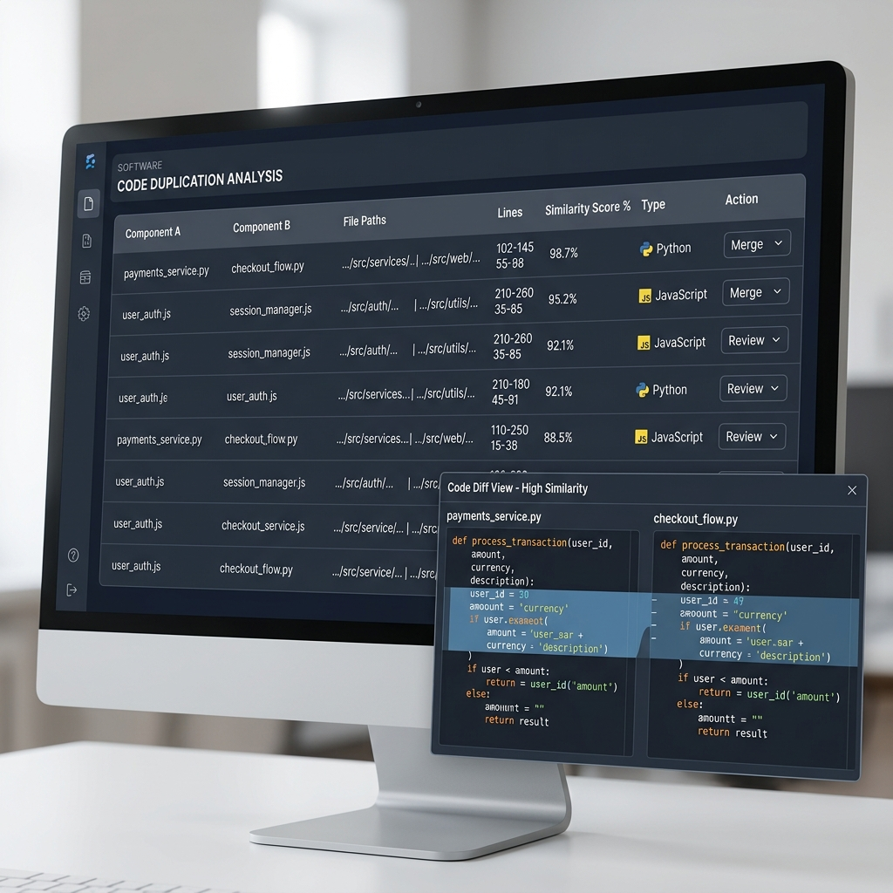
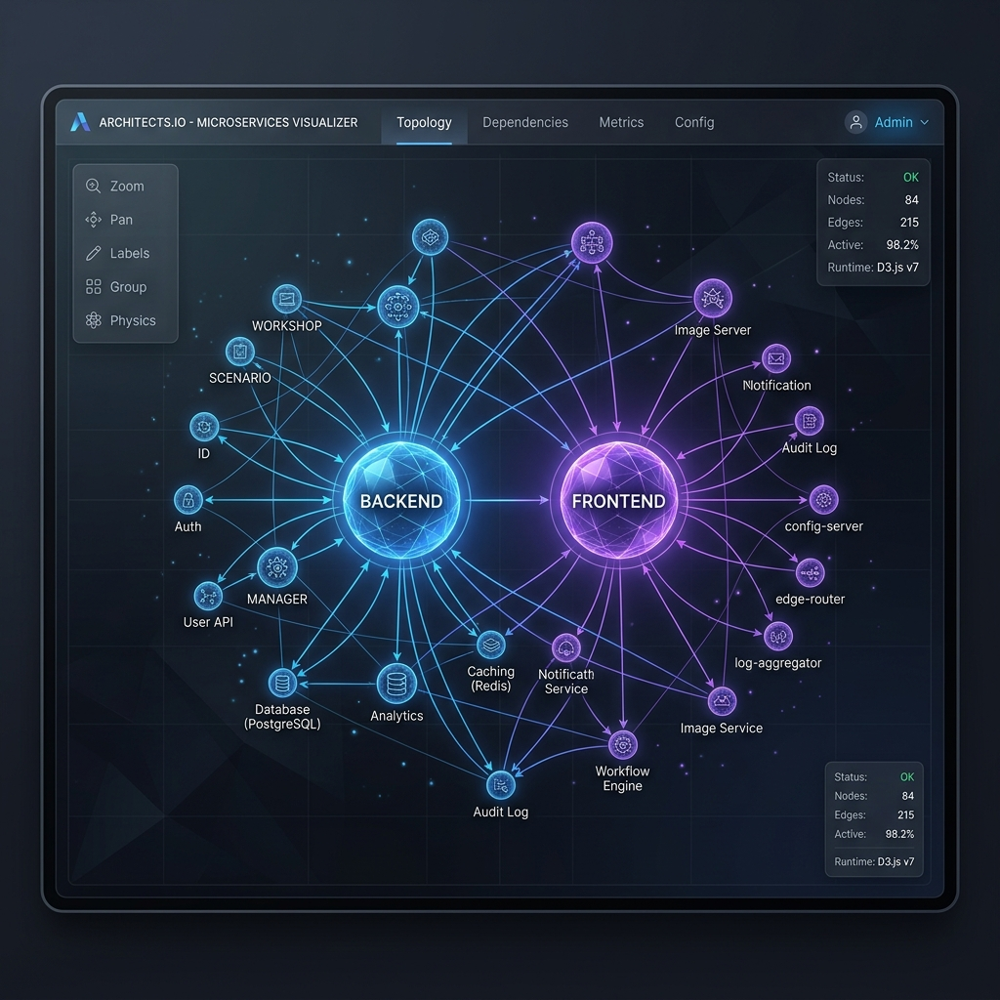
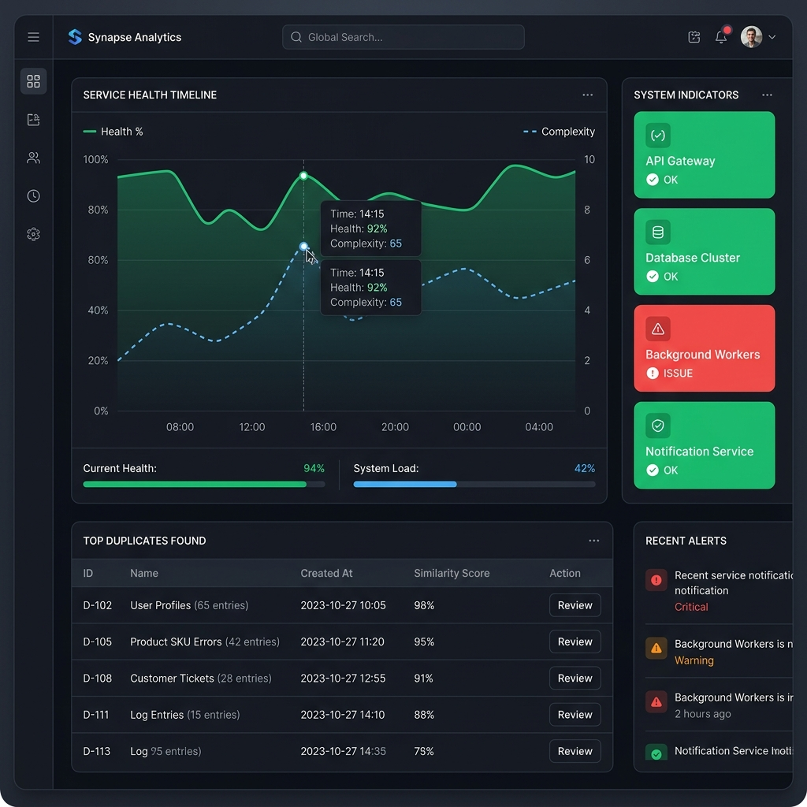

# rebuild


## AI Cost Tracking

   
  

- 🤖 **LLM usage:** $6.9000 (46 commits)
- 👤 **Human dev:** ~$969 (9.7h @ $100/h, 30min dedup)

Generated on 2026-05-02 using [openrouter/qwen/qwen3-coder-next](https://openrouter.ai/qwen/qwen3-coder-next)

---

## Code Evolution Intelligence Engine

   

**Historical deployment analysis & Code Intelligence** — walk git history day by day, deploy per commit, test all endpoints, capture screenshots, and **analyze code evolution** to find duplicates, rank quality, and generate refactor plans.

---

## 📖 Documentation
- **[Full Usage Guide](docs/usage.md)**: Step-by-step instructions.
- **[Architecture](docs/architecture.md)**: Detailed layered design.
- **[Changelog](CHANGELOG.md)**: Latest v0.1.10 features.

---

## 🚀 c2004 Case Study: Analyzing a Complex Ecosystem
Applying `rebuild` to the massive **c2004** project (88 subdirectories, thousands of files).

### 1. Eliminating Cross-Component Duplication
**Scenario**: Identifying structural clones between the main `backend` and auxiliary modules like `connect-test` or `frontend`.
```bash
rebuild analyze duplicates /path/to/c2004
```

*Result: Found 1,597 duplicate groups across Python and JS/TS files.*

### 2. Architecture Visualization & Cycle Detection
**Scenario**: Mapping dependencies between `connect-manager`, `workshop`, and `scenario` to find architectural bottlenecks.
```bash
rebuild analyze services /path/to/c2004/backend --export
```

*Result: Generated interactive D3.js map highlighting circular dependencies in the service layer.*

### 3. AI-Powered Refactor Planning
**Scenario**: Generating an automated refactor plan with an AI Executive Summary for the team.
```bash
rebuild refactor plan /path/to/c2004/backend --ai
rebuild refactor pr /path/to/c2004/backend
```
*Result: 122 high-impact suggestions with automated Markdown PR descriptions.*

### 4. Health & Quality Timeline
**Scenario**: Tracking how code complexity affects system stability over time.
```bash
rebuild dashboard --repo /path/to/c2004
```

*Result: Visualized correlation between technical debt and API pass rates.*

---

## What it does

1. **Intelligence Layer** — Detects structural & semantic duplicates (Python/JS/TS), builds service graphs, vector search embeddings, and ranks code quality across history.
2. **Decision Engine** — Generates and executes refactoring plans with **AI support**.
3. **Walk** — Iterates through git history day by day (Incremental, Replay, Accelerator modes).
4. **Deploy** — Starts the service per commit (Isolated Docker, Replay with code sync, Accelerator with hot reload).
5. **Scan & Test** — Automated endpoint discovery (OpenAPI, FastAPI routes, Traefik), TestQL execution, auth login, param substitution.
6. **Visualization** — D3.js interactive graphs, health dashboards, SSE live event streaming, code evolution playback.
7. **Automation** — Auto PR creation, DSL scripting, NLP natural language commands.

---

## Examples

Explore ready-to-run scenarios in [`examples/`](examples/):
- **[01-dry-run-walk](examples/01-dry-run-walk/)**: Standard walk + intelligence.
- **[02-docker-compose-project](examples/02-docker-compose-project/)**: Full pipeline with **Docker isolation**.
- **[03-restore-endpoint](examples/03-restore-endpoint/)**: Discovering "truth" and extracting endpoints.

---

## License

Licensed under Apache-2.0.
