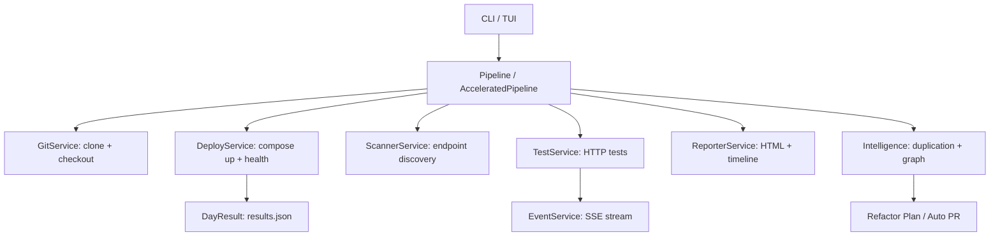

# Rebuild Architecture

The system is designed as a **Code Evolution Intelligence Engine**, structured in strict layers to ensure maintainability and testability.

**Version:** 0.1.23 | **Tests:** 634 passing | **Coverage:** 72% | **Functions:** 3722 | **Classes:** 161 | **CC̄:** 3.9

> See also: [README](../README.md) · [Usage Guide](usage.md) · [CLI Reference](reference/cli.md) · [Config Reference](reference/config.md) · [Changelog](../CHANGELOG.md)

## Layers

### 1. Interfaces (`interfaces/`)
- **CLI (`cli.py`)**: Thin routing layer using Typer. Commands: `walk`, `restore`, `analyze`, `refactor`, `accelerator`, `auto-pr`, `dsl`, `nlp`, `mvp`, `serve`, `evolution`, `tui`.
- **TUI (`tui.py`)**: Interactive terminal interface for exploration and manual execution.
- **Dashboard (`dashboard.py`)**: Visualization of health %, trend charts, endpoint diffs, SSE live streaming.
- **Evolution Viz (`evolution_viz.py`)**: D3.js code evolution playback.

### 2. Application Layer (`application/`)
- **Pipeline (`pipeline.py`)**: Central orchestrator for the walk → deploy → test → report workflow. Supports Incremental, Replay, and Accelerator modes.
- **AcceleratedPipeline (`accelerated_pipeline.py`)**: 10x faster variant using git worktrees and bind-mount code swapping.
- **BasePipeline (`base_pipeline.py`)**: Shared state management, event emission, incremental tracking via `walk_state.json`.
- **Services (`services/`)**: Standardized units of work implementing the `Service[Input, Output]` protocol.

#### Key Services

| Service | Responsibility |
|---------|---------------|
| `GitService` | Git history traversal, clone, checkout, diff |
| `DeployService` | Docker Compose / uvicorn deploy with retry & error classification |
| `ScannerService` | OpenAPI, FastAPI AST, Traefik endpoint discovery |
| `TestService` | HTTP endpoint testing with auth, param substitution, body injection |
| `RestoreService` | Extract last working code for a broken endpoint |
| `HistoryService` | Load and parse historical `results.json` files |
| `ReporterService` | Generate HTML reports and timeline/dashboard |
| `EventService` | Singleton SSE event bus for live streaming |
| `WorktreeManager` | Git worktree creation/cleanup for Accelerator mode |
| `DBSnapshotManager` | Database snapshot/restore for instant state reset |
| `PatcherService` | Dockerfile patching for Accelerator compatibility |
| `OverrideService` | Apply patch directory overlays to cloned repo |
| `ScreenshotService` | Playwright-based screenshot capture with retries |
| `SmartTestSelector` | Git-diff based selective endpoint testing |
| `ParallelTestEngine` | Dependency graph-based parallel test execution |
| `NLPService` | Natural language command parsing |
| `AcceleratorDeployService` | Hot-reload code swapping without container rebuild |

### 3. Intelligence Layer (`analysis/`)
- **Duplication Engine**: Structural AST analysis to find clones across Python, JS/TS.
- **Service Graph**: Architectural model with dependency cycle detection.
- **Truth Ranker**: Ranking implementations based on historical stability.
- **Graph Exporter**: Interactive D3.js dependency visualization.
- **Semantic Embeddings**: `sentence-transformers` for conceptual similarity detection.
- **Vector Search**: SQLite-backed vector index for rapid semantic lookup.

### 4. Domain Layer (`domain/`)
Pure models — no side effects, used across all layers:

| Model | Description |
|-------|-------------|
| `WalkConfig` | All pipeline configuration (repo, days, deploy, auth, timeouts) |
| `CommitInfo` | Git commit metadata (sha, message, author, timestamp, date) |
| `Endpoint` | Discovered API endpoint (method, path, base_url, template_path) |
| `EndpointResult` | Test outcome (status, http_status, time_ms, fail_reason) |
| `DayResult` | Aggregated day results (deploy, health%, endpoints, error_category) |
| `DSLCommand` | Parsed DSL instruction |
| `DeployErrorCategory` | Enum: port_conflict, compose_build_fail, migration_fail, missing_env, unknown |

### 5. Infrastructure Layer (`infrastructure/`)
- **ShellAdapter**: Safe subprocess execution wrapper.
- **HttpAdapter**: httpx-based HTTP client with exponential backoff.
- **ConfigLoader**: `rebuild.yaml` loading and CLI merge.
- **FilesystemAdapter**: Path utilities and file operations.

## Data Flow



## Deploy Error Classification

`DeployService._classify_deploy_error()` automatically categorizes failures from docker compose logs:

```
compose_build_fail  ← "build failed", "npm ci", "dockerfile"
port_conflict       ← "address already in use", "port is already allocated"
migration_fail      ← "migration", "alembic", "flyway"
missing_env         ← "environment variable", "KeyError"
unknown             ← everything else
```

## Incremental State

The pipeline persists processed commit SHAs in `walk_state.json` to avoid reprocessing:
```json
{"processed_shas": ["abc123", "def456"]}
```

## Event Sourcing

All pipeline actions are appended to `history.jsonl` as newline-delimited JSON:
```json
{"event": "DAY_STARTED", "day": "2025-01-01", "commit": "abc123", "ts": "..."}
{"event": "DAY_COMPLETED", "health_pct": 87.5, "ok": 7, "total": 8, "ts": "..."}
```

## Service Graph

Visualize the internal service dependency graph:
```bash
rebuild analyze services
```

See [Analyze guide](guide/analyze.md) for full documentation on analysis commands.

## Notification Hooks

Webhook notifications (Slack, Discord, generic) can be configured in `rebuild.yaml` under `notifications:`.
Fires on deploy failures and health regressions. See [Config Reference](reference/config.md).

## Plugin System

Custom scanners and reporters can be registered via Python entry points (`rebuild.scanners`, `rebuild.reporters`).
See [Plugin Guide](guide/plugins.md) for examples.
