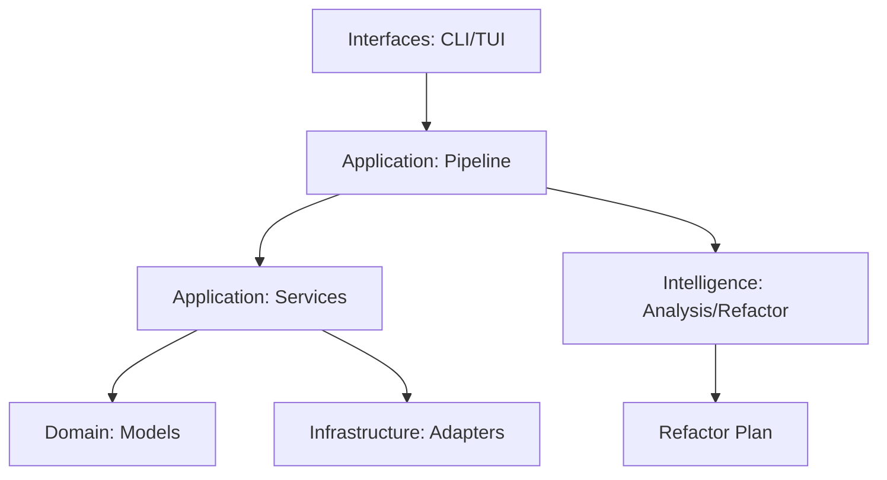

# Rebuild Architecture

The system is designed as a **Code Evolution Intelligence Engine**, structured in strict layers to ensure maintainability and testability.

## Layers

### 1. Interfaces (`interfaces/`)
- **CLI (`cli.py`)**: Thin routing layer using Typer. Delegating all logic to the Pipeline or Services.
- **TUI (`tui.py`)**: Interactive terminal interface for exploration and manual execution.
- **Dashboard (`dashboard.py`)**: Visualization of metrics (Health vs Complexity).

### 2. Application Layer (`application/`)
- **Pipeline (`pipeline.py`)**: The central orchestrator. It composes services to execute the "walk → test → report" workflow.
- **Services (`services/`)**: Standardized units of work (e.g. `GitService`, `ScannerService`, `TestService`). All services implement a common interface for easy injection.

### 3. Intelligence Layer (`analysis/`)
- **Duplication Engine**: Structural AST analysis to find clones.
- **Service Graph**: Architectural model with dependency cycle detection.
- **Truth Ranker**: Ranking implementations based on historical stability and structural quality.
- **Recommendation Engine**: Generating actionable refactoring plans based on analysis insights.

### 4. Domain Layer (`domain/`)
- **Pure Models**: Standardized data structures (`Endpoint`, `DayResult`, `CommitInfo`) used across all layers. No side effects.

### 5. Infrastructure Layer (`infrastructure/`)
- Low-level adapters for external tools (Git, Playwright, Filesystem).

## Data Flow



## Service Graph

The system maintains a Directed Acyclic Graph (DAG) of its internal services to prevent architectural rot. You can visualize it via:
```bash
rebuild analyze services
```
