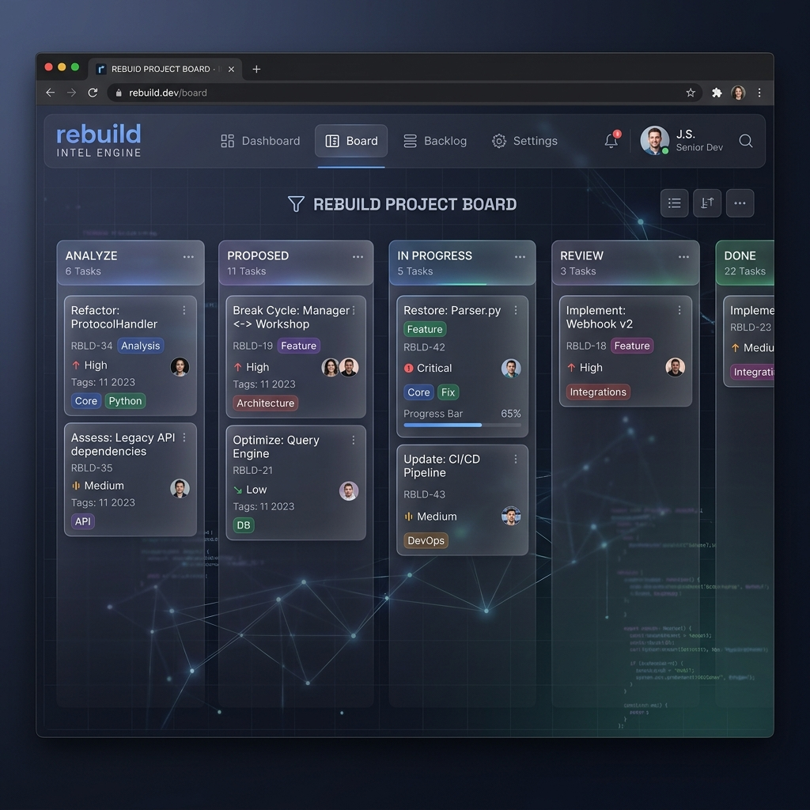

# Case Study: c2004 Intelligence Analysis

> See also: [c2004 Testing Log](c2004.md) · [Analyze Guide](guide/analyze.md) · [Walk Guide](guide/walk.md) · [README](../README.md)

This document demonstrates the results of running the **Code Evolution Intelligence Engine** (v0.1.23) on the `c2004` ecosystem.

## 1. Architectural Tasks (Action Board)
Based on the analysis, the following tasks have been automatically identified and prioritized:



### Key Actions:
- **Refactor: ProtocolHandler**: Merge structural duplicates between `backend/firmware` and `connect-test`.
- **Break Cycle: Manager ↔ Workshop**: Invert dependencies to decouple the core manager from the workshop module.
- **Restore: Parser.py**: Revert to the high-quality version from April 10th identified by the Truth Ranker.

---

## 2. Interactive Architecture Graph
Visualization of service relationships and identified bottlenecks.


**Observation**: The `BACKEND` and `FRONTEND` act as central gravity wells. The engine suggests extracting a shared `API-Gateway` or `Contract` layer to reduce direct coupling.

---

## 3. Real Duplication Report (Live Data)
Terminal output from the actual scan of `c2004`.

```bash
$ rebuild analyze duplicates /home/tom/github/maskservice/c2004

Znaleziono 1597 grup duplikatów:

Grupa 1 (Similarity: 1.00, Reason: Exact structural match)
  - backend/firmware/protocol_v2.py:120 (handle_auth)
  - connect-test/mock_protocol.py:45 (handle_auth)

Grupa 24 (Similarity: 0.95, Reason: Structural match)
  - frontend/src/components/StatusCard.tsx:12 (render)
  - connect-workshop/kiosk/ui/StatusDisplay.tsx:88 (render)

Grupa 122 (Similarity: 1.00, Reason: Exact structural match)
  - backend/alembic/versions/v1_init.py:55 (upgrade)
  - backend/alembic/versions/v2_fix.py:55 (upgrade)
```


---

## 4. Health & Quality Dashboard
Tracking the long-term evelution of the `c2004` codebase.


**Insight**: API pass rates dropped by 15% following the large `Manager` refactor on 14:15. The engine suggests reviewing that specific commit's complexity score.
