# System Architecture Analysis

## Overview

- **Project**: /home/tom/github/semcod/resplit
- **Primary Language**: python
- **Languages**: python: 11, yaml: 10, md: 7, shell: 4, txt: 1
- **Analysis Mode**: static
- **Total Functions**: 221
- **Total Classes**: 9
- **Modules**: 34
- **Entry Points**: 172

## Architecture by Module

### SUMD
- **Functions**: 141
- **File**: `SUMD.md`

### project.map.toon
- **Functions**: 104
- **File**: `map.toon.yaml`

### SUMR
- **Functions**: 35
- **File**: `SUMR.md`

### resplit.deployer
- **Functions**: 9
- **File**: `deployer.py`

### resplit.cli
- **Functions**: 8
- **File**: `cli.py`

### resplit.git_walker
- **Functions**: 6
- **File**: `git_walker.py`

### resplit.reporter
- **Functions**: 6
- **File**: `reporter.py`

### resplit.endpoint_scanner
- **Functions**: 6
- **File**: `endpoint_scanner.py`

### resplit.tester
- **Functions**: 6
- **File**: `tester.py`

### resplit.restorer
- **Functions**: 5
- **File**: `restorer.py`

### resplit.screenshotter
- **Functions**: 5
- **Classes**: 2
- **File**: `screenshotter.py`

### resplit.dashboard
- **Functions**: 4
- **File**: `dashboard.py`

### testql-scenarios.generated-from-pytests.testql.toon
- **Functions**: 2
- **File**: `generated-from-pytests.testql.toon.yaml`

### docs.README
- **Functions**: 1
- **File**: `README.md`

### resplit.models
- **Functions**: 0
- **Classes**: 7
- **File**: `models.py`

## Key Entry Points

Main execution flows into the system:

### resplit.cli.walk
> Przejdź historię git dzień po dniu, deployuj i testuj endpointy.
- **Calls**: app.command, typer.Argument, typer.Option, typer.Option, typer.Option, typer.Option, typer.Option, typer.Option

### resplit.cli.report
> Wygeneruj zbiorczy raport z istniejących wyników.
- **Calls**: app.command, typer.Option, sorted, resplit.reporter.save_timeline_index, console.print, Path, results_dir.iterdir, commit_file.exists

### resplit.cli.dashboard
> Wygeneruj dashboard porównawczy: timeline health% + CC.
- **Calls**: app.command, typer.Option, typer.Option, sorted, resplit.dashboard.generate_dashboard, console.print, Path, results_dir.iterdir

### resplit.restorer.extract_endpoint
> Wyodrębnia endpoint do izolowanego projektu.

Strategia:
- Szuka pliku routera zawierającego ścieżkę endpointu
- Kopiuje router + powiązane handlery
-
- **Calls**: target.mkdir, docker_dir.mkdir, resplit.restorer._find_backend_files, resplit.restorer._write_readme, console.print, src.exists, df.exists, backend_dir.mkdir

### resplit.cli.restore
> Przywróć działający endpoint jako izolowany projekt.
- **Calls**: app.command, typer.Argument, typer.Argument, typer.Option, typer.Option, project.map.toon.find_last_working_day, console.print, project.map.toon.extract_endpoint

### resplit.restorer.find_last_working_day
> Przeszukuje wyniki walk i zwraca ostatni dzień,
w którym endpoint zwracał status OK.
- **Calls**: sorted, results_dir.iterdir, json.loads, rf.exists, date.fromisoformat, rf.read_text, r.get, r.get

### resplit.screenshotter.take_screenshots_batch
> Batch screenshots. urls = [(url, filename), ...].
Reużywa jednej instancji przeglądarki dla wszystkich URLi.
- **Calls**: cfg.output_dir.mkdir, resplit.screenshotter._batch_playwright, ScreenshotResult, ScreenshotResult, str

### resplit.cli.version
> Pokaż wersję resplit.
- **Calls**: app.command, console.print

### docs.README.generate_readme

### testql-scenarios.generated-from-pytests.testql.toon.all

### project.map.toon.walk

### project.map.toon.restore

### project.map.toon.report

### project.map.toon.version

### project.map.toon._probe_endpoints

### project.map.toon._take_screenshot

### project.map.toon._print_day_summary

### project.map.toon._print_summary_table

### project.map.toon.detect_deploy_method

### project.map.toon._compose_file

### project.map.toon.start

### project.map.toon.stop

### project.map.toon._compose_up

### project.map.toon._compose_down

### project.map.toon._uvicorn_start

### project.map.toon._uvicorn_stop

### project.map.toon._wait_healthy

### project.map.toon.scan_endpoints

### project.map.toon._scan_via_deta

### project.map.toon._ports_to_endpoints

## Process Flows

Key execution flows identified:

### Flow 1: walk
```
walk [resplit.cli]
```

### Flow 2: report
```
report [resplit.cli]
  └─ →> save_timeline_index
```

### Flow 3: dashboard
```
dashboard [resplit.cli]
  └─ →> generate_dashboard
      └─> _render_html
```

### Flow 4: extract_endpoint
```
extract_endpoint [resplit.restorer]
  └─> _find_backend_files
  └─> _write_readme
```

### Flow 5: restore
```
restore [resplit.cli]
```

### Flow 6: find_last_working_day
```
find_last_working_day [resplit.restorer]
```

### Flow 7: take_screenshots_batch
```
take_screenshots_batch [resplit.screenshotter]
  └─> _batch_playwright
```

### Flow 8: version
```
version [resplit.cli]
```

### Flow 9: generate_readme
```
generate_readme [docs.README]
```

### Flow 10: all
```
all [testql-scenarios.generated-from-pytests.testql.toon]
```

## Key Classes

### resplit.models.DayResult
- **Methods**: 3
- **Key Methods**: resplit.models.DayResult.ok_count, resplit.models.DayResult.fail_count, resplit.models.DayResult.health_pct

### resplit.models.Endpoint
- **Methods**: 2
- **Key Methods**: resplit.models.Endpoint.url, resplit.models.Endpoint.slug

### resplit.models.DeployMethod
- **Methods**: 0
- **Inherits**: str, Enum

### resplit.models.EndpointStatus
- **Methods**: 0
- **Inherits**: str, Enum

### resplit.models.CommitInfo
- **Methods**: 0

### resplit.models.EndpointResult
- **Methods**: 0

### resplit.models.WalkConfig
- **Methods**: 0

### resplit.screenshotter.ScreenshotConfig
- **Methods**: 0

### resplit.screenshotter.ScreenshotResult
- **Methods**: 0

## Data Transformation Functions

Key functions that process and transform data:

### resplit.endpoint_scanner._parse_openapi
- **Output to**: spec.get, paths.items, methods.items, method.upper, details.get

### project.map.toon._parse_openapi

### project.map.toon.test_parse_openapi

### project.map.toon.test_get_commit_for_day_parses_output

### SUMD._parse_openapi

### SUMD.test_parse_openapi

### SUMD.test_get_commit_for_day_parses_output

### SUMR._parse_openapi

### resplit.tester._parse_testql_results
> Parsuje JSON z testql i mapuje na EndpointResult.

Format testql JSON (zakładany):
[
  {"path": "/ap
- **Output to**: json.loads, idx.get, item.get, ep_results.append, results_path.read_text

## Public API Surface

Functions exposed as public API (no underscore prefix):

- `resplit.cli.walk` - 60 calls
- `resplit.cli.report` - 31 calls
- `resplit.cli.dashboard` - 22 calls
- `resplit.restorer.extract_endpoint` - 19 calls
- `resplit.cli.restore` - 16 calls
- `resplit.reporter.save_json` - 9 calls
- `resplit.endpoint_scanner.scan_endpoints` - 9 calls
- `resplit.dashboard.generate_dashboard` - 9 calls
- `resplit.screenshotter.take_screenshot` - 9 calls
- `resplit.git_walker.get_commit_for_day` - 8 calls
- `resplit.reporter.save_timeline_index` - 8 calls
- `resplit.restorer.find_last_working_day` - 8 calls
- `resplit.reporter.save_html` - 7 calls
- `resplit.dashboard.get_cc_for_day` - 5 calls
- `resplit.screenshotter.take_screenshots_batch` - 5 calls
- `resplit.git_walker.iter_days` - 4 calls
- `resplit.deployer.detect_deploy_method` - 4 calls
- `resplit.tester.run_tests` - 4 calls
- `resplit.deployer.start` - 3 calls
- `resplit.git_walker.restore_head` - 2 calls
- `resplit.reporter.save_day` - 2 calls
- `resplit.deployer.stop` - 2 calls
- `resplit.cli.version` - 2 calls
- `resplit.screenshotter.screenshot_endpoint` - 2 calls
- `resplit.git_walker.checkout` - 1 calls
- `resplit.git_walker.days_with_commits` - 1 calls
- `docs.README.generate_readme` - 0 calls
- `testql-scenarios.generated-from-pytests.testql.toon.all` - 0 calls
- `project.map.toon.walk` - 0 calls
- `project.map.toon.restore` - 0 calls
- `project.map.toon.report` - 0 calls
- `project.map.toon.version` - 0 calls
- `project.map.toon.detect_deploy_method` - 0 calls
- `project.map.toon.start` - 0 calls
- `project.map.toon.stop` - 0 calls
- `project.map.toon.scan_endpoints` - 0 calls
- `project.map.toon.get_commit_for_day` - 0 calls
- `project.map.toon.iter_days` - 0 calls
- `project.map.toon.checkout` - 0 calls
- `project.map.toon.restore_head` - 0 calls

## System Interactions

How components interact:

```mermaid
graph TD
    walk --> command
    walk --> Argument
    walk --> Option
    report --> command
    report --> Option
    report --> sorted
    report --> save_timeline_index
    report --> print
    dashboard --> command
    dashboard --> Option
    dashboard --> sorted
    dashboard --> generate_dashboard
    extract_endpoint --> mkdir
    extract_endpoint --> _find_backend_files
    extract_endpoint --> _write_readme
    extract_endpoint --> print
    restore --> command
    restore --> Argument
    restore --> Option
    find_last_working_da --> sorted
    find_last_working_da --> iterdir
    find_last_working_da --> loads
    find_last_working_da --> exists
    find_last_working_da --> fromisoformat
    take_screenshots_bat --> mkdir
    take_screenshots_bat --> _batch_playwright
    take_screenshots_bat --> ScreenshotResult
    take_screenshots_bat --> str
    version --> command
    version --> print
```



## Reverse Engineering Guidelines

1. **Entry Points**: Start analysis from the entry points listed above
2. **Core Logic**: Focus on classes with many methods
3. **Data Flow**: Follow data transformation functions
4. **Process Flows**: Use the flow diagrams for execution paths
5. **API Surface**: Public API functions reveal the interface

## Context for LLM

Maintain the identified architectural patterns and public API surface when suggesting changes.