# System Architecture Analysis

## Overview

- **Project**: /home/tom/github/semcod/resplit
- **Primary Language**: md
- **Languages**: md: 21, yaml: 17, txt: 10, json: 9, shell: 8
- **Analysis Mode**: static
- **Total Functions**: 2828
- **Total Classes**: 0
- **Modules**: 79
- **Entry Points**: 2802

## Architecture by Module

### SUMD
- **Functions**: 61235
- **File**: `SUMD.md`

### restored_c2004_health.api-health.backend.site.src.main
- **Functions**: 52
- **File**: `main.js`

### scripts.bump_version
- **Functions**: 10
- **File**: `bump_version.py`

### restored_c2004_health.api-health.backend.modules.connect-config-network.api.main
- **Functions**: 9
- **File**: `main.py`

### restored_c2004_health.api-health.backend.modules.connect-id-user-list.api.main
- **Functions**: 9
- **File**: `main.py`

### restored_c2004_health.api-health.backend.modules.connect-manager-library.api.main
- **Functions**: 9
- **File**: `main.py`

### restored_c2004_health.api-health.backend.modules.connect-reports-month.api.main
- **Functions**: 9
- **File**: `main.py`

### examples.09-mvp-protocol.README
- **Functions**: 5
- **File**: `README.md`

### examples.08-nlp-commands.README
- **Functions**: 4
- **File**: `README.md`

### testql-scenarios.generated-from-pytests.testql.toon
- **Functions**: 2
- **File**: `generated-from-pytests.testql.toon.yaml`

### docs.README
- **Functions**: 1
- **File**: `README.md`

## Key Entry Points

Main execution flows into the system:

### scripts.bump_version.main
- **Calls**: argparse.ArgumentParser, parser.add_argument, parser.add_argument, parser.add_argument, parser.parse_args, scripts.bump_version.read_version, scripts.bump_version.bump, examples.08-nlp-commands.README.print

### restored_c2004_health.api-health.backend.site.src.main.handleRoute
- **Calls**: restored_c2004_health.api-health.backend.site.src.main.getRoute, restored_c2004_health.api-health.backend.site.src.main.updateActiveNav, restored_c2004_health.api-health.backend.site.src.main.renderHome, restored_c2004_health.api-health.backend.site.src.main.renderSidebar, restored_c2004_health.api-health.backend.site.src.main.renderDownloads, restored_c2004_health.api-health.backend.site.src.main.renderArchitecture, restored_c2004_health.api-health.backend.site.src.main.renderServices, restored_c2004_health.api-health.backend.site.src.main.startsWith

### restored_c2004_health.api-health.backend.site.src.main.route
- **Calls**: restored_c2004_health.api-health.backend.site.src.main.renderHome, restored_c2004_health.api-health.backend.site.src.main.renderSidebar, restored_c2004_health.api-health.backend.site.src.main.renderDownloads, restored_c2004_health.api-health.backend.site.src.main.renderArchitecture, restored_c2004_health.api-health.backend.site.src.main.renderServices, restored_c2004_health.api-health.backend.site.src.main.startsWith, restored_c2004_health.api-health.backend.site.src.main.replace, restored_c2004_health.api-health.backend.site.src.main.renderDocs

### restored_c2004_health.api-health.backend.modules.connect-config-network.api.main.serve_ui
- **Calls**: app.get, FileResponse, HTTPException, filename.endswith, file_path.exists, Path, Path

### restored_c2004_health.api-health.backend.modules.connect-config-network.api.main.serve_model
- **Calls**: app.get, FileResponse, HTTPException, filename.endswith, file_path.exists, Path, Path

### restored_c2004_health.api-health.backend.modules.connect-id-user-list.api.main.serve_ui
- **Calls**: app.get, FileResponse, HTTPException, filename.endswith, file_path.exists, Path, Path

### restored_c2004_health.api-health.backend.modules.connect-id-user-list.api.main.serve_model
- **Calls**: app.get, FileResponse, HTTPException, filename.endswith, file_path.exists, Path, Path

### restored_c2004_health.api-health.backend.modules.connect-manager-library.api.main.serve_ui
- **Calls**: app.get, FileResponse, HTTPException, filename.endswith, file_path.exists, Path, Path

### restored_c2004_health.api-health.backend.modules.connect-manager-library.api.main.serve_model
- **Calls**: app.get, FileResponse, HTTPException, filename.endswith, file_path.exists, Path, Path

### restored_c2004_health.api-health.backend.modules.connect-reports-month.api.main.serve_ui
- **Calls**: app.get, FileResponse, HTTPException, filename.endswith, file_path.exists, Path, Path

### restored_c2004_health.api-health.backend.modules.connect-reports-month.api.main.serve_model
- **Calls**: app.get, FileResponse, HTTPException, filename.endswith, file_path.exists, Path, Path

### restored_c2004_health.api-health.backend.site.src.main.start
- **Calls**: restored_c2004_health.api-health.backend.site.src.main.AbortController, restored_c2004_health.api-health.backend.site.src.main.setTimeout, restored_c2004_health.api-health.backend.site.src.main.abort, restored_c2004_health.api-health.backend.site.src.main.fetch, restored_c2004_health.api-health.backend.site.src.main.clearTimeout, restored_c2004_health.api-health.backend.site.src.main.round, restored_c2004_health.api-health.backend.site.src.main.now

### restored_c2004_health.api-health.backend.modules.connect-config-network.api.main.get_manifest
- **Calls**: app.get, PlainTextResponse, MANIFEST_PATH.exists, HTTPException, MANIFEST_PATH.read_text

### restored_c2004_health.api-health.backend.modules.connect-config-network.api.main.list_models
- **Calls**: app.get, model_dir.exists, Path, model_dir.iterdir, f.is_file

### restored_c2004_health.api-health.backend.modules.connect-id-user-list.api.main.get_manifest
- **Calls**: app.get, PlainTextResponse, MANIFEST_PATH.exists, HTTPException, MANIFEST_PATH.read_text

### restored_c2004_health.api-health.backend.modules.connect-id-user-list.api.main.list_models
- **Calls**: app.get, model_dir.exists, Path, model_dir.iterdir, f.is_file

### restored_c2004_health.api-health.backend.modules.connect-manager-library.api.main.get_manifest
- **Calls**: app.get, PlainTextResponse, MANIFEST_PATH.exists, HTTPException, MANIFEST_PATH.read_text

### restored_c2004_health.api-health.backend.modules.connect-manager-library.api.main.list_models
- **Calls**: app.get, model_dir.exists, Path, model_dir.iterdir, f.is_file

### restored_c2004_health.api-health.backend.modules.connect-reports-month.api.main.get_manifest
- **Calls**: app.get, PlainTextResponse, MANIFEST_PATH.exists, HTTPException, MANIFEST_PATH.read_text

### restored_c2004_health.api-health.backend.modules.connect-reports-month.api.main.list_models
- **Calls**: app.get, model_dir.exists, Path, model_dir.iterdir, f.is_file

### restored_c2004_health.api-health.backend.site.src.main.summary
- **Calls**: restored_c2004_health.api-health.backend.site.src.main.all, restored_c2004_health.api-health.backend.site.src.main.map, restored_c2004_health.api-health.backend.site.src.main.checkServiceHealth, restored_c2004_health.api-health.backend.site.src.main.push, restored_c2004_health.api-health.backend.site.src.main.getElementById

### restored_c2004_health.api-health.backend.site.src.main.healthyEl
- **Calls**: restored_c2004_health.api-health.backend.site.src.main.all, restored_c2004_health.api-health.backend.site.src.main.map, restored_c2004_health.api-health.backend.site.src.main.checkServiceHealth, restored_c2004_health.api-health.backend.site.src.main.push, restored_c2004_health.api-health.backend.site.src.main.getElementById

### restored_c2004_health.api-health.backend.site.src.main.unhealthyEl
- **Calls**: restored_c2004_health.api-health.backend.site.src.main.all, restored_c2004_health.api-health.backend.site.src.main.map, restored_c2004_health.api-health.backend.site.src.main.checkServiceHealth, restored_c2004_health.api-health.backend.site.src.main.push, restored_c2004_health.api-health.backend.site.src.main.getElementById

### restored_c2004_health.api-health.backend.site.src.main.table
- **Calls**: restored_c2004_health.api-health.backend.site.src.main.all, restored_c2004_health.api-health.backend.site.src.main.map, restored_c2004_health.api-health.backend.site.src.main.checkServiceHealth, restored_c2004_health.api-health.backend.site.src.main.push, restored_c2004_health.api-health.backend.site.src.main.getElementById

### restored_c2004_health.api-health.backend.site.src.main.allServices
- **Calls**: restored_c2004_health.api-health.backend.site.src.main.all, restored_c2004_health.api-health.backend.site.src.main.map, restored_c2004_health.api-health.backend.site.src.main.checkServiceHealth, restored_c2004_health.api-health.backend.site.src.main.push, restored_c2004_health.api-health.backend.site.src.main.getElementById

### restored_c2004_health.api-health.backend.site.src.main.marked
- **Calls**: restored_c2004_health.api-health.backend.site.src.main.markedHighlight, restored_c2004_health.api-health.backend.site.src.main.highlight, restored_c2004_health.api-health.backend.site.src.main.getLanguage, restored_c2004_health.api-health.backend.site.src.main.highlightAuto

### restored_c2004_health.api-health.backend.modules.connect-config-network.api.main.index
- **Calls**: app.get, HTMLResponse, restored_c2004_health.api-health.backend.modules.connect-config-network.api.main._index_html

### restored_c2004_health.api-health.backend.modules.connect-config-network.api.main.module_index
- **Calls**: app.get, HTMLResponse, restored_c2004_health.api-health.backend.modules.connect-config-network.api.main._index_html

### restored_c2004_health.api-health.backend.modules.connect-id-user-list.api.main.index
- **Calls**: app.get, HTMLResponse, restored_c2004_health.api-health.backend.modules.connect-id-user-list.api.main._index_html

### restored_c2004_health.api-health.backend.modules.connect-id-user-list.api.main.module_index
- **Calls**: app.get, HTMLResponse, restored_c2004_health.api-health.backend.modules.connect-id-user-list.api.main._index_html

## Process Flows

Key execution flows identified:

### Flow 1: main
```
main [scripts.bump_version]
```

### Flow 2: handleRoute
```
handleRoute [restored_c2004_health.api-health.backend.site.src.main]
  └─> getRoute
  └─> updateActiveNav
```

### Flow 3: route
```
route [restored_c2004_health.api-health.backend.site.src.main]
  └─> renderHome
  └─> renderSidebar
      └─> esc
```

### Flow 4: serve_ui
```
serve_ui [restored_c2004_health.api-health.backend.modules.connect-config-network.api.main]
```

### Flow 5: serve_model
```
serve_model [restored_c2004_health.api-health.backend.modules.connect-config-network.api.main]
```

### Flow 6: start
```
start [restored_c2004_health.api-health.backend.site.src.main]
```

### Flow 7: get_manifest
```
get_manifest [restored_c2004_health.api-health.backend.modules.connect-config-network.api.main]
```

### Flow 8: list_models
```
list_models [restored_c2004_health.api-health.backend.modules.connect-config-network.api.main]
```

## Data Transformation Functions

Key functions that process and transform data:

### SUMD._parse_numeric

### SUMD.parse_date

### SUMD.parse_xml_protocol

### SUMD._process_output_var

### SUMD._process_param_var

### SUMD._process_op_var

### SUMD._process_output_keys

### SUMD._process_param_conditions

### SUMD._process_alarms

### SUMD._process_steps

### SUMD._process_tasks

### SUMD._process_goal

### SUMD._process_scenario_data

### SUMD._parse_content

### SUMD._parse_units_list

### SUMD._process_scenarios

### SUMD._process_out_entity

### SUMD._process_op_entity

### SUMD._process_prm_entity

### SUMD._process_output_tasks

### SUMD._process_parameter_conditions

### SUMD._convert_else_step

### SUMD._process_goal_steps

### SUMD._process_scenario

### SUMD._process_message_step

## Public API Surface

Functions exposed as public API (no underscore prefix):

- `scripts.bump_version.main` - 20 calls
- `scripts.bump_version.categorize_commits` - 15 calls
- `scripts.bump_version.build_new_section` - 14 calls
- `scripts.bump_version.update_changelog` - 14 calls
- `restored_c2004_health.api-health.backend.site.src.main.renderDownloads` - 11 calls
- `restored_c2004_health.api-health.backend.site.src.main.renderArchitecture` - 11 calls
- `restored_c2004_health.api-health.backend.site.src.main.handleRoute` - 10 calls
- `restored_c2004_health.api-health.backend.site.src.main.runHealthCheck` - 10 calls
- `restored_c2004_health.api-health.backend.site.src.main.renderDocs` - 9 calls
- `restored_c2004_health.api-health.backend.site.src.main.route` - 8 calls
- `restored_c2004_health.api-health.backend.modules.connect-config-network.api.main.serve_ui` - 7 calls
- `restored_c2004_health.api-health.backend.modules.connect-config-network.api.main.serve_model` - 7 calls
- `restored_c2004_health.api-health.backend.modules.connect-id-user-list.api.main.serve_ui` - 7 calls
- `restored_c2004_health.api-health.backend.modules.connect-id-user-list.api.main.serve_model` - 7 calls
- `restored_c2004_health.api-health.backend.modules.connect-manager-library.api.main.serve_ui` - 7 calls
- `restored_c2004_health.api-health.backend.modules.connect-manager-library.api.main.serve_model` - 7 calls
- `restored_c2004_health.api-health.backend.modules.connect-reports-month.api.main.serve_ui` - 7 calls
- `restored_c2004_health.api-health.backend.modules.connect-reports-month.api.main.serve_model` - 7 calls
- `restored_c2004_health.api-health.backend.site.src.main.checkServiceHealth` - 7 calls
- `restored_c2004_health.api-health.backend.site.src.main.start` - 7 calls
- `scripts.bump_version.bump` - 7 calls
- `scripts.bump_version.get_git_log_since_last_tag` - 7 calls
- `scripts.bump_version.update_init` - 6 calls
- `scripts.bump_version.update_pyproject` - 6 calls
- `scripts.bump_version.collect_unreleased_entries` - 6 calls
- `restored_c2004_health.api-health.backend.modules.connect-config-network.api.main.get_manifest` - 5 calls
- `restored_c2004_health.api-health.backend.modules.connect-config-network.api.main.list_models` - 5 calls
- `restored_c2004_health.api-health.backend.modules.connect-id-user-list.api.main.get_manifest` - 5 calls
- `restored_c2004_health.api-health.backend.modules.connect-id-user-list.api.main.list_models` - 5 calls
- `restored_c2004_health.api-health.backend.modules.connect-manager-library.api.main.get_manifest` - 5 calls
- `restored_c2004_health.api-health.backend.modules.connect-manager-library.api.main.list_models` - 5 calls
- `restored_c2004_health.api-health.backend.modules.connect-reports-month.api.main.get_manifest` - 5 calls
- `restored_c2004_health.api-health.backend.modules.connect-reports-month.api.main.list_models` - 5 calls
- `restored_c2004_health.api-health.backend.site.src.main.summary` - 5 calls
- `restored_c2004_health.api-health.backend.site.src.main.healthyEl` - 5 calls
- `restored_c2004_health.api-health.backend.site.src.main.unhealthyEl` - 5 calls
- `restored_c2004_health.api-health.backend.site.src.main.table` - 5 calls
- `restored_c2004_health.api-health.backend.site.src.main.allServices` - 5 calls
- `restored_c2004_health.api-health.backend.site.src.main.marked` - 4 calls
- `restored_c2004_health.api-health.backend.site.src.main.updateActiveNav` - 4 calls

## System Interactions

How components interact:

```mermaid
graph TD
    main --> ArgumentParser
    main --> add_argument
    main --> parse_args
    handleRoute --> getRoute
    handleRoute --> updateActiveNav
    handleRoute --> renderHome
    handleRoute --> renderSidebar
    handleRoute --> renderDownloads
    route --> renderHome
    route --> renderSidebar
    route --> renderDownloads
    route --> renderArchitecture
    route --> renderServices
    serve_ui --> get
    serve_ui --> FileResponse
    serve_ui --> HTTPException
    serve_ui --> endswith
    serve_ui --> exists
    serve_model --> get
    serve_model --> FileResponse
    serve_model --> HTTPException
    serve_model --> endswith
    serve_model --> exists
    start --> AbortController
    start --> setTimeout
    start --> abort
    start --> fetch
    start --> clearTimeout
    get_manifest --> get
    get_manifest --> PlainTextResponse
```



## Reverse Engineering Guidelines

1. **Entry Points**: Start analysis from the entry points listed above
2. **Core Logic**: Focus on classes with many methods
3. **Data Flow**: Follow data transformation functions
4. **Process Flows**: Use the flow diagrams for execution paths
5. **API Surface**: Public API functions reveal the interface

## Context for LLM

Maintain the identified architectural patterns and public API surface when suggesting changes.