# System Architecture Analysis
<!-- generated in 0.01s -->

## Overview

- **Project**: /home/tom/github/semcod/rebuild
- **Primary Language**: python
- **Languages**: python: 98, md: 32, yaml: 15, shell: 8, yml: 3
- **Analysis Mode**: static
- **Total Functions**: 3722
- **Total Classes**: 161
- **Modules**: 164
- **Entry Points**: 3665

## Architecture by Module

### SUMD
- **Functions**: 61729
- **File**: `SUMD.md`

### rebuild.interfaces.cli
- **Functions**: 24
- **File**: `cli.py`

### rebuild.application.services.accelerator_deploy
- **Functions**: 23
- **Classes**: 1
- **File**: `accelerator_deploy.py`

### rebuild.application.services.db_snapshot_manager
- **Functions**: 22
- **Classes**: 2
- **File**: `db_snapshot_manager.py`

### rebuild.application.services.deploy_service
- **Functions**: 20
- **Classes**: 1
- **File**: `deploy_service.py`

### rebuild.application.services.parallel_test_engine
- **Functions**: 19
- **Classes**: 3
- **File**: `parallel_test_engine.py`

### rebuild.analysis.service_graph
- **Functions**: 17
- **Classes**: 6
- **File**: `service_graph.py`

### rebuild.application.services.scanner_service
- **Functions**: 14
- **Classes**: 1
- **File**: `scanner_service.py`

### rebuild.plugins.registry
- **Functions**: 14
- **Classes**: 1
- **File**: `registry.py`

### rebuild.application.services.notification_service
- **Functions**: 14
- **Classes**: 4
- **File**: `notification_service.py`

### rebuild.domain.mvp_protocol
- **Functions**: 14
- **Classes**: 4
- **File**: `mvp_protocol.py`

### rebuild.analysis.duplication_engine
- **Functions**: 14
- **Classes**: 3
- **File**: `duplication_engine.py`

### rebuild.domain.dsl
- **Functions**: 13
- **Classes**: 5
- **File**: `dsl.py`

### rebuild.infrastructure.event_bus
- **Functions**: 12
- **Classes**: 1
- **File**: `event_bus.py`

### rebuild.application.accelerated_pipeline
- **Functions**: 11
- **Classes**: 1
- **File**: `accelerated_pipeline.py`

### rebuild.analysis.vector_search
- **Functions**: 11
- **Classes**: 2
- **File**: `vector_search.py`

### rebuild.application.services.reporting.reporter
- **Functions**: 11
- **Classes**: 1
- **File**: `reporter.py`

### rebuild.domain.dsl_v2
- **Functions**: 11
- **Classes**: 11
- **File**: `dsl_v2.py`

### scripts.bump_version
- **Functions**: 10
- **File**: `bump_version.py`

### rebuild.application.services.git_service
- **Functions**: 10
- **Classes**: 1
- **File**: `git_service.py`

## Key Entry Points

Main execution flows into the system:

### rebuild.interfaces.api.app.create_app
> Create and return a FastAPI application.

All dependencies are injected — ideal for testing.
- **Calls**: FastAPI, app.add_middleware, app.post, app.post, app.post, app.post, app.post, app.post

### rebuild.interfaces.commands.walk_command.walk_command
- **Calls**: repo.resolve, output.resolve, DeployService, WalkConfig, config_path.exists, overrides.get, overrides.get, overrides.get

### rebuild.application.accelerated_pipeline.AcceleratedPipeline._run_day_fast
> Execute single day analysis with maximum speed.
- **Calls**: time.perf_counter, self.log, DayResult, str, self._emit, self.deploy.switch_commit, self._emit, self.worktrees.get_active_path

### rebuild.interfaces.cli.auto_pr
> Utwórz Pull/Merge Request z AI-generated summary z wyników analizy.
- **Calls**: app.command, typer.Argument, typer.Option, typer.Option, typer.Option, typer.Option, typer.Option, typer.Option

### rebuild.application.pipeline.Pipeline.run_day
- **Calls**: self.log, time.perf_counter, DayResult, getattr, str, self.scanner.execute, self._emit, self.log

### rebuild.interfaces.commands.analyze_command.multi_repo_command
- **Calls**: MultiRepoAnalyzer, console.print, Table, repo_table.add_column, repo_table.add_column, report.repositories.items, console.print, console.print

### rebuild.application.services.history_service.HistoryService.load_history
- **Calls**: sorted, results_dir.exists, results_dir.iterdir, self._load_commit, json.loads, isinstance, DayResult, all_results.append

### rebuild.interfaces.cli.walk
> Przejdź historię git dzień po dniu, deployuj i testuj endpointy.
- **Calls**: app.command, typer.Argument, typer.Option, typer.Option, typer.Option, typer.Option, typer.Option, typer.Option

### rebuild.application.accelerated_pipeline.AcceleratedPipeline.run
> Run accelerated analysis over commit history.
- **Calls**: self.git.days_with_commits, self._emit, self.log, self.log, self.log, self._prewarm_worktrees, self.worktrees.get_active_path, self.deploy.prepare_runtime

### rebuild.infrastructure.config_loader.ConfigLoader.apply_to_config
> Updates WalkConfig instance with data from YAML.
- **Calls**: yaml_data.get, Path, int, isinstance, bool, config.test_fixtures.update, config.auth.update, isinstance

### rebuild.application.pipeline.Pipeline.run
- **Calls**: self.git.days_with_commits, self._event_service.enable, self._emit, self.log, self._emit, self.reporter.save_timeline_index, self.log, self.log

### rebuild.interfaces.commands.helpers.serve_reports
- **Calls**: os.chdir, SUMD.get_event_service, event_service.enable, socketserver.TCPServer, console.print, console.print, console.print, None.start

### rebuild.interfaces.cli.dsl
> Wykonaj DSL (Domain Specific Language) komendy rebuild.
- **Calls**: app.command, typer.Option, typer.Option, typer.Option, DSLParser, DSLInterpreter, console.print, typer.Exit

### rebuild.interfaces.commands.analyze_command.services_command
- **Calls**: console.print, ServiceGraphBuilder, builder.build, builder.detect_cycles, ServiceSimilarityAnalyzer, analyzer.analyze_directory, path.resolve, GraphExporter

### rebuild.interfaces.commands.walk_command.accelerator_command
- **Calls**: repo.resolve, WalkConfig, console.print, console.print, console.print, console.print, console.print, console.print

### rebuild.refactor.recommendation_engine.RecommendationEngine.generate_plan
- **Calls**: graph.items, sorted, suggestions.append, suggestions.append, suggestions.append, len, suggestions.append, RefactorSuggestion

### rebuild.application.services.reporting.reporter.ReporterService.save_timeline_index
- **Calls**: output_dir.mkdir, sorted, self._health_trend_by_day, self._endpoint_count_trend_by_day, self._results_to_export_data, None.write_text, SUMD.generate_trend_chart, SUMD.generate_endpoint_diff

### rebuild.domain.mvp_protocol.MVPServer.start
> Start the MVP server.
- **Calls**: socketserver.TCPServer, Makefile.print, httpd.serve_forever, int, None.decode, self.headers.get, MVPMessage.from_json, server.handler.handle_message

### rebuild.infrastructure.config_schema.ProjectConfig._validate_deploy_and_output
- **Calls**: model_validator, isinstance, isinstance, isinstance, ValueError, ValueError, OutputConfig.model_validate, isinstance

### rebuild.interfaces.cli.plugins
> Wylistuj zainstalowane pluginy (scanners, reporters).
- **Calls**: app.command, typer.Option, SUMD.load_plugins, Table, table.add_column, table.add_column, table.add_column, table.add_column

### rebuild.analysis.duplication_engine.DuplicationEngine.scan
- **Calls**: self.collect_fragments, exact_matches.items, fuzzy_matches.items, self._find_semantic_groups, groups.extend, sorted, None.append, id

### rebuild.application.services.scanner_service.ScannerService._scan_via_fastapi_routes
- **Calls**: set, repo.rglob, any, self._collect_router_prefixes, ast.walk, ast.parse, py_file.read_text, isinstance

### rebuild.interfaces.cli.accelerator
> ⚡ Ultra-szybki tryb 10x - worktree + hot reload + parallel testing.
- **Calls**: app.command, typer.Argument, typer.Option, typer.Option, typer.Option, typer.Option, typer.Option, typer.Option

### rebuild.analysis.duplication_engine.DuplicationEngine._find_semantic_groups
- **Calls**: self._get_semantic_encoder, set, range, len, len, self._semantic_text, encoder.encode, len

### rebuild.infrastructure.event_bus.EventBus.publish
> Publish event — dispatch to all registered handlers.
- **Calls**: self._sync_handlers.get, set, list, type, asyncio.get_running_loop, self._async_handlers.get, self._event_store.append, SUMD.handler

### scripts.bump_version.main
- **Calls**: argparse.ArgumentParser, parser.add_argument, parser.add_argument, parser.add_argument, parser.parse_args, scripts.bump_version.read_version, scripts.bump_version.bump, Makefile.print

### rebuild.interfaces.commands.analyze_command.vector_query_command
- **Calls**: index.resolve, VectorSearchIndex, vs.query, Table, table.add_column, table.add_column, table.add_column, table.add_column

### rebuild.interfaces.commands.helpers.print_summary_table
- **Calls**: Table, table.add_column, table.add_column, table.add_column, table.add_column, table.add_column, table.add_column, table.add_column

### rebuild.application.services.restore_service.RestoreService.extract_endpoint
- **Calls**: target.mkdir, docker_dir.mkdir, self._find_backend_files, self._write_readme, self.console.print, src.exists, df.exists, backend_dir.mkdir

### rebuild.interfaces.commands.refactor_command.plan_command
- **Calls**: rebuild.interfaces.commands.refactor_command._generate_refactor_plan, console.print, enumerate, console.print, LLMService, llm.is_available, console.print, console.print

## Process Flows

Key execution flows identified:

### Flow 1: create_app
```
create_app [rebuild.interfaces.api.app]
```

### Flow 2: walk_command
```
walk_command [rebuild.interfaces.commands.walk_command]
```

### Flow 3: _run_day_fast
```
_run_day_fast [rebuild.application.accelerated_pipeline.AcceleratedPipeline]
```

### Flow 4: auto_pr
```
auto_pr [rebuild.interfaces.cli]
```

### Flow 5: run_day
```
run_day [rebuild.application.pipeline.Pipeline]
```

### Flow 6: multi_repo_command
```
multi_repo_command [rebuild.interfaces.commands.analyze_command]
```

### Flow 7: load_history
```
load_history [rebuild.application.services.history_service.HistoryService]
```

### Flow 8: walk
```
walk [rebuild.interfaces.cli]
```

### Flow 9: run
```
run [rebuild.application.accelerated_pipeline.AcceleratedPipeline]
```

### Flow 10: apply_to_config
```
apply_to_config [rebuild.infrastructure.config_loader.ConfigLoader]
```

## Key Classes

### rebuild.application.services.accelerator_deploy.AcceleratorDeployService
> 10x faster deployment using:
1. Git worktrees (instant code checkout)
2. Bind volume mounts (no cont
- **Methods**: 23
- **Key Methods**: rebuild.application.services.accelerator_deploy.AcceleratorDeployService.__init__, rebuild.application.services.accelerator_deploy.AcceleratorDeployService.start, rebuild.application.services.accelerator_deploy.AcceleratorDeployService.prepare_runtime, rebuild.application.services.accelerator_deploy.AcceleratorDeployService._accelerated_compose_up, rebuild.application.services.accelerator_deploy.AcceleratorDeployService.switch_commit, rebuild.application.services.accelerator_deploy.AcceleratorDeployService._update_bind_mount, rebuild.application.services.accelerator_deploy.AcceleratorDeployService._sync_code_to_container, rebuild.application.services.accelerator_deploy.AcceleratorDeployService._get_changed_files, rebuild.application.services.accelerator_deploy.AcceleratorDeployService._copy_changed_files, rebuild.application.services.accelerator_deploy.AcceleratorDeployService._get_container_name
- **Inherits**: DeployService

### rebuild.application.services.db_snapshot_manager.DBSnapshotManager
> Manages database snapshots for instant state restore.

Instead of re-seeding DB for each test run:
1
- **Methods**: 22
- **Key Methods**: rebuild.application.services.db_snapshot_manager.DBSnapshotManager.__init__, rebuild.application.services.db_snapshot_manager.DBSnapshotManager._ensure_dirs, rebuild.application.services.db_snapshot_manager.DBSnapshotManager._load_metadata, rebuild.application.services.db_snapshot_manager.DBSnapshotManager._save_metadata, rebuild.application.services.db_snapshot_manager.DBSnapshotManager.create, rebuild.application.services.db_snapshot_manager.DBSnapshotManager._auto_prune, rebuild.application.services.db_snapshot_manager.DBSnapshotManager.prune_old, rebuild.application.services.db_snapshot_manager.DBSnapshotManager.stats, rebuild.application.services.db_snapshot_manager.DBSnapshotManager._postgres_dump, rebuild.application.services.db_snapshot_manager.DBSnapshotManager._mysql_dump
- **Inherits**: <ast.Subscript object at 0x71099f6bcfd0>

### rebuild.application.services.deploy_service.DeployService
> Service for managing the lifecycle of the service being analyzed.
Supports 'Replay Mode' (Invariant 
- **Methods**: 20
- **Key Methods**: rebuild.application.services.deploy_service.DeployService.__init__, rebuild.application.services.deploy_service.DeployService.detect_deploy_method, rebuild.application.services.deploy_service.DeployService.start, rebuild.application.services.deploy_service.DeployService.execute, rebuild.application.services.deploy_service.DeployService.wait_healthy, rebuild.application.services.deploy_service.DeployService.reload, rebuild.application.services.deploy_service.DeployService.stop, rebuild.application.services.deploy_service.DeployService._compose_file, rebuild.application.services.deploy_service.DeployService._compose_up, rebuild.application.services.deploy_service.DeployService._compose_down
- **Inherits**: <ast.Subscript object at 0x71099f823210>

### rebuild.application.services.scanner_service.ScannerService
> Service for discovering API endpoints in a repository.
- **Methods**: 14
- **Key Methods**: rebuild.application.services.scanner_service.ScannerService.__init__, rebuild.application.services.scanner_service.ScannerService.execute, rebuild.application.services.scanner_service.ScannerService._scan_via_deta, rebuild.application.services.scanner_service.ScannerService._scan_via_fastapi_routes, rebuild.application.services.scanner_service.ScannerService._collect_router_prefixes, rebuild.application.services.scanner_service.ScannerService._extract_route_path, rebuild.application.services.scanner_service.ScannerService._join_route_path, rebuild.application.services.scanner_service.ScannerService._ports_to_endpoints, rebuild.application.services.scanner_service.ScannerService._scan_via_openapi, rebuild.application.services.scanner_service.ScannerService._scan_via_openapi_file
- **Inherits**: <ast.Subscript object at 0x7109a08bb910>

### rebuild.application.services.parallel_test_engine.ParallelTestEngine
> High-performance parallel test execution.

Features:
- Health-first: /health, /metrics run first, ab
- **Methods**: 14
- **Key Methods**: rebuild.application.services.parallel_test_engine.ParallelTestEngine.__init__, rebuild.application.services.parallel_test_engine.ParallelTestEngine.open_session, rebuild.application.services.parallel_test_engine.ParallelTestEngine._open_client, rebuild.application.services.parallel_test_engine.ParallelTestEngine.close_session, rebuild.application.services.parallel_test_engine.ParallelTestEngine._close_client, rebuild.application.services.parallel_test_engine.ParallelTestEngine.set_day_dir, rebuild.application.services.parallel_test_engine.ParallelTestEngine._setup_default_dependencies, rebuild.application.services.parallel_test_engine.ParallelTestEngine.execute, rebuild.application.services.parallel_test_engine.ParallelTestEngine._is_health_endpoint, rebuild.application.services.parallel_test_engine.ParallelTestEngine._login_if_configured

### rebuild.analysis.duplication_engine.DuplicationEngine
> Engine for detecting structural and semantic duplication in codebases.
Supports Python (AST) and JS/
- **Methods**: 14
- **Key Methods**: rebuild.analysis.duplication_engine.DuplicationEngine.__init__, rebuild.analysis.duplication_engine.DuplicationEngine.scan, rebuild.analysis.duplication_engine.DuplicationEngine.collect_fragments, rebuild.analysis.duplication_engine.DuplicationEngine._find_semantic_groups, rebuild.analysis.duplication_engine.DuplicationEngine._get_semantic_encoder, rebuild.analysis.duplication_engine.DuplicationEngine._semantic_text, rebuild.analysis.duplication_engine.DuplicationEngine._semantic_group_hash, rebuild.analysis.duplication_engine.DuplicationEngine._average_group_similarity, rebuild.analysis.duplication_engine.DuplicationEngine._cosine_similarity, rebuild.analysis.duplication_engine.DuplicationEngine._extract_fragments

### rebuild.plugins.registry.PluginRegistry
> Central registry for rebuild plugins.

Usage::

    registry = PluginRegistry()
    registry.discove
- **Methods**: 13
- **Key Methods**: rebuild.plugins.registry.PluginRegistry.__init__, rebuild.plugins.registry.PluginRegistry.discover, rebuild.plugins.registry.PluginRegistry.register_scanner, rebuild.plugins.registry.PluginRegistry.register_reporter, rebuild.plugins.registry.PluginRegistry.unregister_scanner, rebuild.plugins.registry.PluginRegistry.unregister_reporter, rebuild.plugins.registry.PluginRegistry.scanners, rebuild.plugins.registry.PluginRegistry.reporters, rebuild.plugins.registry.PluginRegistry.get_scanner, rebuild.plugins.registry.PluginRegistry.get_reporter

### rebuild.analysis.service_graph.MultiRepoAnalyzer
> Analyze cross-repo dependencies and shared structural code clones.
- **Methods**: 12
- **Key Methods**: rebuild.analysis.service_graph.MultiRepoAnalyzer.__init__, rebuild.analysis.service_graph.MultiRepoAnalyzer.analyze, rebuild.analysis.service_graph.MultiRepoAnalyzer.export_json, rebuild.analysis.service_graph.MultiRepoAnalyzer._normalize_repo_keys, rebuild.analysis.service_graph.MultiRepoAnalyzer._repo_aliases, rebuild.analysis.service_graph.MultiRepoAnalyzer._analyze_dependencies, rebuild.analysis.service_graph.MultiRepoAnalyzer._import_roots, rebuild.analysis.service_graph.MultiRepoAnalyzer._analyze_shared_clones, rebuild.analysis.service_graph.MultiRepoAnalyzer._iter_python_files, rebuild.analysis.service_graph.MultiRepoAnalyzer._iter_fragment_files

### rebuild.infrastructure.event_bus.EventBus
> Publish/subscribe event bus.

- Sync subscribers: called immediately on publish()
- Async subscriber
- **Methods**: 11
- **Key Methods**: rebuild.infrastructure.event_bus.EventBus.__init__, rebuild.infrastructure.event_bus.EventBus.subscribe, rebuild.infrastructure.event_bus.EventBus.subscribe_async, rebuild.infrastructure.event_bus.EventBus.subscribe_all, rebuild.infrastructure.event_bus.EventBus.subscribe_all_async, rebuild.infrastructure.event_bus.EventBus.unsubscribe, rebuild.infrastructure.event_bus.EventBus.create_ws_queue, rebuild.infrastructure.event_bus.EventBus.remove_ws_queue, rebuild.infrastructure.event_bus.EventBus.publish, rebuild.infrastructure.event_bus.EventBus.publish_many

### rebuild.application.accelerated_pipeline.AcceleratedPipeline
> Ultra-fast pipeline using:
- Git worktrees (instant branch switching)
- Volume-mounted code (no cont
- **Methods**: 11
- **Key Methods**: rebuild.application.accelerated_pipeline.AcceleratedPipeline.__init__, rebuild.application.accelerated_pipeline.AcceleratedPipeline._save_state, rebuild.application.accelerated_pipeline.AcceleratedPipeline.run, rebuild.application.accelerated_pipeline.AcceleratedPipeline._prewarm_worktrees, rebuild.application.accelerated_pipeline.AcceleratedPipeline._create_baseline_snapshot, rebuild.application.accelerated_pipeline.AcceleratedPipeline._run_day_fast, rebuild.application.accelerated_pipeline.AcceleratedPipeline._needs_rescan, rebuild.application.accelerated_pipeline.AcceleratedPipeline._needs_db_restore, rebuild.application.accelerated_pipeline.AcceleratedPipeline._diff_names_cached, rebuild.application.accelerated_pipeline.AcceleratedPipeline._restore_db_fast
- **Inherits**: BasePipeline

### rebuild.analysis.vector_search.VectorSearchIndex
> SQLite-backed vector index for semantic lookup of code fragments.
- **Methods**: 11
- **Key Methods**: rebuild.analysis.vector_search.VectorSearchIndex.__init__, rebuild.analysis.vector_search.VectorSearchIndex._ensure_schema, rebuild.analysis.vector_search.VectorSearchIndex.build_from_path, rebuild.analysis.vector_search.VectorSearchIndex.upsert_fragments, rebuild.analysis.vector_search.VectorSearchIndex.query, rebuild.analysis.vector_search.VectorSearchIndex.count, rebuild.analysis.vector_search.VectorSearchIndex._load_rows, rebuild.analysis.vector_search.VectorSearchIndex._get_model, rebuild.analysis.vector_search.VectorSearchIndex._fragment_id, rebuild.analysis.vector_search.VectorSearchIndex._to_text

### rebuild.application.services.reporting.reporter.ReporterService
> Thin orchestrator: delegates to formatters, chart_builder, and saves files.
- **Methods**: 11
- **Key Methods**: rebuild.application.services.reporting.reporter.ReporterService.execute, rebuild.application.services.reporting.reporter.ReporterService.to_yaml, rebuild.application.services.reporting.reporter.ReporterService.to_toon, rebuild.application.services.reporting.reporter.ReporterService.save_day, rebuild.application.services.reporting.reporter.ReporterService._save_html_day, rebuild.application.services.reporting.reporter.ReporterService.save_timeline_index, rebuild.application.services.reporting.reporter.ReporterService.export_csv, rebuild.application.services.reporting.reporter.ReporterService.export_markdown, rebuild.application.services.reporting.reporter.ReporterService._health_trend_by_day, rebuild.application.services.reporting.reporter.ReporterService._endpoint_count_trend_by_day
- **Inherits**: <ast.Subscript object at 0x71099eb9f8d0>

### rebuild.application.services.notification_service.NotificationService
> Send webhook notifications on rebuild events.

Usage::

    svc = NotificationService()
    svc.add_
- **Methods**: 11
- **Key Methods**: rebuild.application.services.notification_service.NotificationService.__init__, rebuild.application.services.notification_service.NotificationService.add_webhook, rebuild.application.services.notification_service.NotificationService.remove_webhook, rebuild.application.services.notification_service.NotificationService.clear, rebuild.application.services.notification_service.NotificationService.hooks, rebuild.application.services.notification_service.NotificationService.notify, rebuild.application.services.notification_service.NotificationService.notify_deploy_fail, rebuild.application.services.notification_service.NotificationService.notify_health_regression, rebuild.application.services.notification_service.NotificationService.notify_walk_complete, rebuild.application.services.notification_service.NotificationService._build_body

### rebuild.application.services.git_service.GitService
> Service for interacting with Git repositories and history.
Uses ShellAdapter for all git commands.
- **Methods**: 10
- **Key Methods**: rebuild.application.services.git_service.GitService.__init__, rebuild.application.services.git_service.GitService.execute, rebuild.application.services.git_service.GitService.days_with_commits, rebuild.application.services.git_service.GitService.get_current_sha, rebuild.application.services.git_service.GitService.clone_for_walk, rebuild.application.services.git_service.GitService.sync_current_state, rebuild.application.services.git_service.GitService.checkout, rebuild.application.services.git_service.GitService.restore_head, rebuild.application.services.git_service.GitService.diff_names, rebuild.application.services.git_service.GitService._run_git
- **Inherits**: <ast.Subscript object at 0x71099f92f710>

### rebuild.application.services.worktree_manager.WorktreeManager
> Manages git worktrees for ultra-fast branch/commit switching.

Instead of 'git checkout' which modif
- **Methods**: 10
- **Key Methods**: rebuild.application.services.worktree_manager.WorktreeManager.__init__, rebuild.application.services.worktree_manager.WorktreeManager._ensure_base_dir, rebuild.application.services.worktree_manager.WorktreeManager._worktree_path, rebuild.application.services.worktree_manager.WorktreeManager.get_or_create, rebuild.application.services.worktree_manager.WorktreeManager._list_worktrees, rebuild.application.services.worktree_manager.WorktreeManager._remove_worktree, rebuild.application.services.worktree_manager.WorktreeManager.cleanup_all, rebuild.application.services.worktree_manager.WorktreeManager.prepare_sequence, rebuild.application.services.worktree_manager.WorktreeManager.get_active_path, rebuild.application.services.worktree_manager.WorktreeManager.execute
- **Inherits**: <ast.Subscript object at 0x71099f76f850>

### rebuild.domain.dsl.DSLInterpreter
> Interpreter for executing parsed DSL commands.
- **Methods**: 10
- **Key Methods**: rebuild.domain.dsl.DSLInterpreter.__init__, rebuild.domain.dsl.DSLInterpreter.execute, rebuild.domain.dsl.DSLInterpreter.execute_file, rebuild.domain.dsl.DSLInterpreter._handle_walk, rebuild.domain.dsl.DSLInterpreter._handle_analyze, rebuild.domain.dsl.DSLInterpreter._handle_evolution, rebuild.domain.dsl.DSLInterpreter._handle_auto_pr, rebuild.domain.dsl.DSLInterpreter._handle_accelerator, rebuild.domain.dsl.DSLInterpreter._handle_restore, rebuild.domain.dsl.DSLInterpreter._handle_serve

### rebuild.domain.mvp_protocol.MVPProtocolHandler
> Handler for MVP protocol communication.
- **Methods**: 10
- **Key Methods**: rebuild.domain.mvp_protocol.MVPProtocolHandler.__init__, rebuild.domain.mvp_protocol.MVPProtocolHandler.handle_message, rebuild.domain.mvp_protocol.MVPProtocolHandler._handle_command, rebuild.domain.mvp_protocol.MVPProtocolHandler._handle_event, rebuild.domain.mvp_protocol.MVPProtocolHandler._handle_walk, rebuild.domain.mvp_protocol.MVPProtocolHandler._handle_analyze, rebuild.domain.mvp_protocol.MVPProtocolHandler._handle_evolution, rebuild.domain.mvp_protocol.MVPProtocolHandler._handle_auto_pr, rebuild.domain.mvp_protocol.MVPProtocolHandler._handle_dsl, rebuild.domain.mvp_protocol.MVPProtocolHandler._handle_nlp

### rebuild.infrastructure.event_store.EventStore
> Append-only SQLite event store.

Usage::

    store = EventStore(Path(".rebuild/events.db"))
    sto
- **Methods**: 8
- **Key Methods**: rebuild.infrastructure.event_store.EventStore.__init__, rebuild.infrastructure.event_store.EventStore._conn, rebuild.infrastructure.event_store.EventStore.append, rebuild.infrastructure.event_store.EventStore.append_many, rebuild.infrastructure.event_store.EventStore.load, rebuild.infrastructure.event_store.EventStore.load_raw, rebuild.infrastructure.event_store.EventStore.count, rebuild.infrastructure.event_store.EventStore.prune_before

### rebuild.infrastructure.http_adapter.HttpAdapter
> Adapter for HTTP requests.
Centralizes timeout, retry logic, and client management.
- **Methods**: 7
- **Key Methods**: rebuild.infrastructure.http_adapter.HttpAdapter.__init__, rebuild.infrastructure.http_adapter.HttpAdapter.get, rebuild.infrastructure.http_adapter.HttpAdapter.post, rebuild.infrastructure.http_adapter.HttpAdapter.put, rebuild.infrastructure.http_adapter.HttpAdapter.patch, rebuild.infrastructure.http_adapter.HttpAdapter.delete, rebuild.infrastructure.http_adapter.HttpAdapter.close

### rebuild.application.services.restore_service.RestoreService
> Service for restoring a working endpoint from git history.
- **Methods**: 7
- **Key Methods**: rebuild.application.services.restore_service.RestoreService.__init__, rebuild.application.services.restore_service.RestoreService.execute, rebuild.application.services.restore_service.RestoreService.find_last_working_day, rebuild.application.services.restore_service.RestoreService.extract_endpoint, rebuild.application.services.restore_service.RestoreService._find_backend_files, rebuild.application.services.restore_service.RestoreService._is_page_endpoint, rebuild.application.services.restore_service.RestoreService._write_readme
- **Inherits**: <ast.Subscript object at 0x71099f86ba10>

## Data Transformation Functions

Key functions that process and transform data:

### rebuild.application.commands.analyze_commands.AnalyzeCommand._validate_type
- **Output to**: field_validator, ValueError, sorted

### rebuild.application.commands.walk_commands.WalkCommand._validate_deploy
- **Output to**: field_validator, ValueError, sorted

### rebuild.application.commands.walk_commands.WalkCommand._validate_repo
- **Output to**: field_validator, Path, p.exists, ValueError, None.exists

### rebuild.infrastructure.config_loader.ConfigLoader.validate
> Validates rebuild.yaml data and returns a list of human-readable error strings.
An empty list means 
- **Output to**: ConfigSchemaValidator.validate

### rebuild.application.services.scanner_service.ScannerService._parse_openapi
- **Output to**: spec.get, paths.items, self._substitute_params, methods.items, method.upper

### SUMD._parse_numeric

### SUMD.parse_date

### SUMD.parse_xml_protocol

### SUMD._process_output_var

### SUMD._process_param_var

### SUMD._process_op_var

### SUMD._process_output_keys

### SUMD._process_param_conditions

### SUMD._process_alarms

### SUMD._process_steps

### SUMD._process_tasks

### SUMD._process_goal

### SUMD._process_scenario_data

### SUMD._parse_content

### SUMD._parse_units_list

### SUMD._process_scenarios

### SUMD._process_out_entity

### SUMD._process_op_entity

### SUMD._process_prm_entity

### SUMD._process_output_tasks

## Behavioral Patterns

### recursion_to_yaml
- **Type**: recursion
- **Confidence**: 0.90
- **Functions**: rebuild.application.services.reporting.reporter.ReporterService.to_yaml

### recursion_to_toon
- **Type**: recursion
- **Confidence**: 0.90
- **Functions**: rebuild.application.services.reporting.reporter.ReporterService.to_toon

### recursion_to_yaml
- **Type**: recursion
- **Confidence**: 0.90
- **Functions**: rebuild.application.services.reporting.formatters.to_yaml

### state_machine_BasePipeline
- **Type**: state_machine
- **Confidence**: 0.70
- **Functions**: rebuild.application.base_pipeline.BasePipeline.__init__, rebuild.application.base_pipeline.BasePipeline._load_state, rebuild.application.base_pipeline.BasePipeline._save_state, rebuild.application.base_pipeline.BasePipeline._emit, rebuild.application.base_pipeline.BasePipeline.log

## Public API Surface

Functions exposed as public API (no underscore prefix):

- `rebuild.interfaces.api.app.create_app` - 74 calls
- `rebuild.interfaces.commands.walk_command.walk_command` - 53 calls
- `rebuild.interfaces.cli.auto_pr` - 49 calls
- `rebuild.application.pipeline.Pipeline.run_day` - 47 calls
- `rebuild.interfaces.commands.analyze_command.multi_repo_command` - 44 calls
- `rebuild.application.services.history_service.HistoryService.load_history` - 37 calls
- `rebuild.interfaces.cli.walk` - 35 calls
- `rebuild.application.accelerated_pipeline.AcceleratedPipeline.run` - 33 calls
- `rebuild.infrastructure.config_loader.ConfigLoader.apply_to_config` - 32 calls
- `rebuild.application.pipeline.Pipeline.run` - 28 calls
- `rebuild.interfaces.commands.helpers.serve_reports` - 28 calls
- `rebuild.interfaces.cli.dsl` - 26 calls
- `rebuild.interfaces.commands.analyze_command.services_command` - 25 calls
- `rebuild.interfaces.commands.walk_command.accelerator_command` - 24 calls
- `rebuild.refactor.recommendation_engine.RecommendationEngine.generate_plan` - 24 calls
- `rebuild.application.services.reporting.reporter.ReporterService.save_timeline_index` - 23 calls
- `rebuild.domain.mvp_protocol.MVPServer.start` - 23 calls
- `rebuild.interfaces.cli.plugins` - 22 calls
- `rebuild.analysis.duplication_engine.DuplicationEngine.scan` - 22 calls
- `rebuild.interfaces.cli.accelerator` - 21 calls
- `rebuild.infrastructure.event_bus.EventBus.publish` - 20 calls
- `scripts.bump_version.main` - 20 calls
- `rebuild.interfaces.commands.analyze_command.vector_query_command` - 20 calls
- `rebuild.interfaces.commands.helpers.print_summary_table` - 20 calls
- `rebuild.application.services.restore_service.RestoreService.extract_endpoint` - 19 calls
- `rebuild.interfaces.commands.refactor_command.plan_command` - 19 calls
- `rebuild.domain.dsl_v2.NLPMapper.to_dsl` - 19 calls
- `rebuild.analysis.service_similarity.ServiceSimilarityAnalyzer.analyze_directory` - 18 calls
- `rebuild.domain.dsl.DSLParser.parse` - 18 calls
- `rebuild.application.services.reporting.reporter.ReporterService.export_csv` - 17 calls
- `rebuild.interfaces.cli.restore` - 17 calls
- `rebuild.interfaces.commands.analyze_command.truth_command` - 17 calls
- `rebuild.application.services.parallel_test_engine.ParallelTestEngine.execute` - 17 calls
- `rebuild.domain.dsl_v2.DSLParser.parse_tokens` - 17 calls
- `rebuild.application.services.smart_test_selector.SmartTestSelector.select_tests` - 16 calls
- `scripts.bump_version.categorize_commits` - 15 calls
- `rebuild.analysis.vector_search.VectorSearchIndex.upsert_fragments` - 15 calls
- `rebuild.application.services.summary_service.SummaryService.generate_from_duplication` - 15 calls
- `rebuild.application.services.summary_service.SummaryService.generate_from_service_graph` - 15 calls
- `scripts.bump_version.build_new_section` - 14 calls

## System Interactions

How components interact:

```mermaid
graph TD
    create_app --> FastAPI
    create_app --> add_middleware
    create_app --> post
    walk_command --> resolve
    walk_command --> DeployService
    walk_command --> WalkConfig
    walk_command --> exists
    _run_day_fast --> perf_counter
    _run_day_fast --> log
    _run_day_fast --> DayResult
    _run_day_fast --> str
    _run_day_fast --> _emit
    auto_pr --> command
    auto_pr --> Argument
    auto_pr --> Option
    run_day --> log
    run_day --> perf_counter
    run_day --> DayResult
    run_day --> getattr
    run_day --> str
    multi_repo_command --> MultiRepoAnalyzer
    multi_repo_command --> print
    multi_repo_command --> Table
    multi_repo_command --> add_column
    load_history --> sorted
    load_history --> exists
    load_history --> iterdir
    load_history --> _load_commit
    load_history --> loads
    walk --> command
```



## Reverse Engineering Guidelines

1. **Entry Points**: Start analysis from the entry points listed above
2. **Core Logic**: Focus on classes with many methods
3. **Data Flow**: Follow data transformation functions
4. **Process Flows**: Use the flow diagrams for execution paths
5. **API Surface**: Public API functions reveal the interface

## Context for LLM

Maintain the identified architectural patterns and public API surface when suggesting changes.